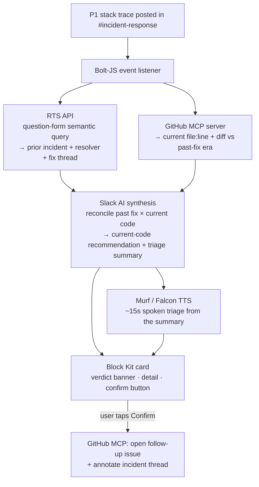

# EchoOps v2 — Winning Spec

**Slack Agent Builder Challenge · Target: Best New Slack Agent ($8K) + Best UX ($2K) + Best Technological Implementation ($2K)**
**Deadline: Mon 13 Jul 2026, 5:00pm PDT (≈ 5:30am IST, Tue 14 Jul). You effectively lose the 14th.**

---

## 0. The one thing that changed

v1 pitched EchoOps as a *multimodal incident agent* and made **audio the differentiator**. That was the weak point: audio is the wrong format for a stack trace, and "I work at Murf so I added voice" reads as a showcase, not a solution.

v2 repositions around what Slack itself is selling. Slack's entire RTS API narrative is *"unlock institutional knowledge trapped in conversations… connect agents to decisions once trapped in silos."* EchoOps becomes the sharpest demonstration of that thesis, pointed at the single highest-pain, most-repeated engineering moment:

> **The 2am incident your team has already fixed — and forgotten.**

**New positioning:** EchoOps is an *institutional-memory incident responder*. When a P1 hits, it recovers **how your own team fixed this exact error last time**, **validates that fix against your current code**, and **re-captures the knowledge** so you stop paying the same tax twice.

The name still works — reframe "Echo" as *your past incidents echoing forward*, not "echo = audio." No repo/asset rename needed.

**Tagline:** *"Your team already fixed this. I'll find out how."*

Why this is the winning frame: aligning with the sponsor's own story is the best single predictor of judge resonance. The judges are Slack devs who have been briefed on exactly this pitch. You're not fighting for novelty — you're handing them the canonical example of their own product.

---

## 1. The three required technologies — each load-bearing

The rule is "use ≥1." v1 used 2 (RTS + MCP) but let an unaligned external LLM (Qwen) do the reasoning. v2 uses **all three**, each doing real work. This is what maxes *Technological Implementation*.

### 1.1 Real-Time Search API — the memory engine (the hero)
When a stack trace lands in `#incident-response`, EchoOps queries workspace history for the prior occurrence of the same error signature and the thread where it was resolved.

**Two non-obvious details that signal mastery to judges:**
- **Phrase the query as a natural-language question** (starts with *what/where/how*, ends with `?`). RTS triggers *semantic* retrieval only for question-form queries; otherwise it falls back to keyword. So build the query as e.g. *"How was the payment gateway timeout `ETIMEDOUT` in checkout resolved before?"* — you get topical matches even when the exact exception string differs from the old thread's wording.
- **Semantic search requires the *Slack AI Search* feature on the workspace.** Verify your sandbox has it via `assistant.search.info`; if not, request a sandbox with it through the Slack Developer Program **today** (this is a hard dependency and a lead-time risk). RTS also has special rate limits — cache within a session.

Output you extract: the resolving message, **who** resolved it, **when**, and the linked fix/PR.

### 1.2 MCP — the code-grounding + action layer
Run/connect an **external GitHub MCP server** the agent calls as tools. Two jobs:
- **Ground:** pull the *current* `file:line` that threw, and **diff** it against the state at the time of the past fix. This answers the killer objection to every "AI incident bot": *does the old fix still apply to today's code?* If the file has drifted, EchoOps says so instead of confidently recommending a stale patch.
- **Close the loop (the winning bow):** on confirm, open a tracked follow-up issue (GitHub/Jira via MCP tool) **and** annotate the incident thread — so the fix is re-captured and the org stops forgetting. This is the feature that turns a chatbot into a story about *organizational learning*.

### 1.3 Slack AI — the synthesis layer (replaces Qwen)
Slack AI reconciles `[past fix] + [current code diff]` into a **current-code-specific** recommendation, and drafts the one triage summary that becomes *both* the card text and the audio VO. Using Slack AI here (instead of Qwen) adds the third required tech and removes an unaligned dependency for zero benefit.

---

## 2. The UX thesis — this is how you win Best UX

Don't win UX by "adding audio." Win it with a defensible **design thesis for the on-call moment**: progressive disclosure, right modality per layer.

The Block Kit response card, top to bottom:
1. **Verdict banner** — one line, the highest-value signal: `✅ Seen before · fixed by @trish · Mar 2026 · current code MATCHES` (or `⚠️ code has since drifted`). This alone is the product.
2. **~15s spoken triage (Murf/Falcon)** — right modality for hands-busy / mobile / 2am / accessibility. **Summary only, never detail.** Justifies "why voice" honestly: an on-call engineer hears the gist while their hands stay on the keyboard.
3. **Expandable detail (text)** — everything copy-pasteable lives here: `file:line`, deep link to the historical thread, the diff, the recommended patch. Audio never has to carry a line number.
4. **Confirm-gated action** — `[ Open follow-up issue ]` button. Human-in-the-loop before any write. This mirrors RTS best practice ("let users confirm before acting") and reads as production-grade judgment — the same guardrail instinct from your BFSI work.

**The rule that keeps this from looking like a gimmick:** *audio is the summary layer; text is the detail carrier.* Say that out loud in the demo.

---

## 3. Architecture (buildable, de-risked)

**Decision: build a Bolt-for-JavaScript app** (Bolt SDK in JS/Python/Java is an officially listed path; Slack ships an AI Bolt-JS template). Bolt-JS gives you unconstrained outbound calls to RTS, the GitHub MCP server, Slack AI, and Murf — no Deno hosted-runtime outbound-domain sandboxing to fight.

**CRITICAL (updated per organizer guidance): "self-hosted" means YOU own uptime.** Do NOT rely on `slack run` — it uses a laptop-bound websocket that dies the moment your machine sleeps, which would leave your sandbox dead when judges test it. Deploy the Bolt app to an always-on host (Render / Railway / Fly free tier) so the sandbox responds 24/7. Organizer tip, in spirit: *"make sure your external logic is actually live and reachable — not just running on your laptop."* Use `slack run` for local dev only.

**Track note:** we're on the **New Slack Agent** track, so the deliverable is a demo video + architecture diagram + your **developer sandbox with judge access** — NOT a Marketplace submission, NOT a production deploy, NOT the 5-workspace install. All of that (and the App ID) is *Organizations-track only*; ignore it. (If you'd rather Slack host uptime for you, `slack deploy` to the hosted Deno platform also works and is always-on, but then you adopt the Deno function model and must declare Murf + the MCP server as outgoing domains in the manifest. For our track, always-on Bolt is the lower-friction path given your JS strength.)

Note: the GitHub MCP server grounds code; Slack's *own* MCP server is a separate thing (accesses Slack data) — you don't need it, RTS covers the Slack side. If a judge asks, be precise about that distinction.

---

## 4. The 3-minute demo (reworked to lead with memory, not audio)

Keep your production instincts (POV shot, clean split-screen logs, "Trish" as the past resolver). Change what the demo *argues*.

**Judging tempo (organizer guidance): judges spend ~5–7 minutes per project and the first 60 seconds are decisive.** So the "your team already fixed this" pain-and-promise hook must land in the opening 30 seconds — before any architecture. Lead with the problem and the reveal; save the plumbing for the middle.

- **0:00–0:25 — The pain, reframed.** "Every engineering org has already solved most of its incidents. The fix is buried in a Slack thread from eight months ago, and the person who wrote it is asleep. So the team re-solves it from scratch. EchoOps ends that."
- **0:25–0:55 — Trigger.** Trish drops the ugly stack trace into `#incident-response`. Terminal catches the event.
- **0:55–2:00 — The three logs (this is the Technological Implementation score, on screen):**
  - `[RTS] Semantic query → match found: thread from Mar 2026, resolved by @trish`
  - `[MCP] GitHub → current payments.ts:42 diffed vs fix-era → MATCH (fix still applies)`
  - `[Slack AI] Synthesizing current-code recommendation…`
  - `[Murf] 15s triage rendered.`
- **2:00–2:40 — The reveal.** Card appears: verdict banner → play the 15s audio → expand the detail (link to Trish's original thread, the diff, the patch). Narrate the thesis: *"Audio is the glance-able summary. Every line number lives in text you can copy."*
- **2:40–3:00 — The bow (do NOT vaporware this — build it).** Tap **Confirm** → a follow-up issue is created and the thread is annotated. "EchoOps didn't just recover the fix. It re-captured it — so the next on-call engineer never loses it again."

Cut the v1 "Would you like me to open a Jira ticket?" *unless* it's real. In v2 the closing action **is** real (it's your MCP write tool), so show it working.

---

## 5. 4-day build plan (skeleton-first)

Judges' own guidance: a complete-but-rough end-to-end flow beats a slick partial one. Build the spine first, then make each leg real.

- **Day 1 — Spine + de-risk.** Scaffold Bolt-JS app from the AI template. Wire the event listener → Block Kit card round-trip with **everything mocked** (hardcoded past match, fake diff, canned audio). Card renders end-to-end. **In parallel, today:** confirm your sandbox has Slack AI Search (`assistant.search.info`); if not, request one — this is the critical-path dependency.
- **Day 2 — Make RTS + MCP real.** Real question-form RTS query returning a real historical thread. Real GitHub MCP server returning real `file:line` + diff. Keep synthesis + audio mocked.
- **Day 3 — Slack AI + Murf + the confirm action.** Real synthesis, real Murf triage clip, real confirm-gated issue creation + thread annotation. Freeze features here.
- **Day 4 (through early 14th IST) — Demo + submission.** Record the 3-min video, write the README around the *institutional-memory* thesis, export the architecture diagram, grant sandbox access to `slackhack@salesforce.com` and `testing@devpost.com`, submit before 5pm PDT on the 13th.

---

## 6. Judging-criteria map (sanity check)

| Criterion | How v2 scores |
|---|---|
| **Technological Implementation** | All 3 required techs, each load-bearing; semantic-question RTS usage; MCP diff-validation; real write action. Also targets the **Best Tech Implementation $2K**. |
| **Design** | Progressive-disclosure card; audio-as-summary thesis; confirm-gated writes. Targets **Best UX $2K**. |
| **Potential Impact** | Attacks the *root cause* (knowledge decay), not the symptom; re-capture loop = compounding org value. |
| **Quality of the Idea** | Canonical instance of Slack's own RTS thesis on the highest-pain eng moment; the "validate past fix against current code" twist escapes the crowded "AI reads your stack trace" lane. |

---

## 7. Risk / dependency checklist

- [ ] **Sandbox has Slack AI Search** (needed for semantic RTS) — verify `assistant.search.info` **Day 1**; request via Slack Developer Program if missing. *Highest lead-time risk.*
- [ ] RTS rate limits respected (cache within session).
- [ ] Demo channel + historical thread set up so RTS actually returns the match (mind public-vs-private channel scoping — from a public channel RTS returns only public results).
- [ ] **App deployed to an always-on host** (NOT `slack run` on your laptop) so the sandbox is live when judges test. *New must-have per organizer guidance.*
- [ ] GitHub MCP server reachable from your always-on Bolt host.
- [ ] Confirm action is **real**, not implied.
- [ ] Sandbox access granted to `slackhack@salesforce.com` + `testing@devpost.com`.
- [ ] Architecture diagram exported as a submission artifact.
- [ ] Demo video: hook lands in first 30–60s (judges give ~5–7 min/project).
- [ ] Submitted before **13 Jul 5pm PDT** (≈ 5:30am IST 14 Jul).
- [ ] *Skip entirely (Orgs-track only, not our track):* Marketplace submission, production deploy, 5-workspace install, App ID.

---

## 8. Honest note on "definite winner"

No spec can guarantee a win — 2,600+ entrants, subjective judging. What v2 does is give you the strongest *odds*: sponsor-aligned framing, all three techs used meaningfully, the feasibility risks pre-solved, a defensible UX thesis, and a novelty angle that survives an engineer judge poking at it. The remaining variables are execution and the demo — which is exactly where your build-first speed and DevRel storytelling are an edge. Close those and this is a top-of-track submission.
