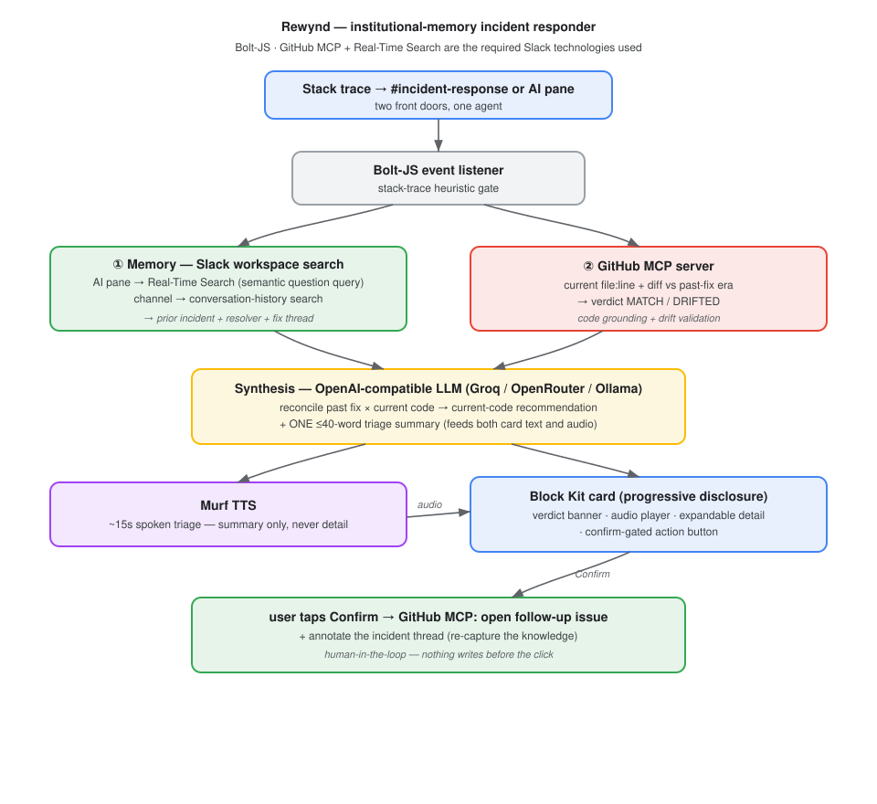

# Rewynd

### Your team already fixed this. I'll find out how.

**Rewynd is an institutional-memory incident responder for Slack.** When a P1
stack trace lands in `#incident-response`, Rewynd recovers **how your own team
fixed this exact error last time**, **validates that fix against your current
code**, speaks a ~15-second triage summary, and — on one human click —
**re-captures the knowledge** as a tracked issue so you stop paying the same tax
twice.

Built for the **Slack Agent Builder Challenge** (New Slack Agent track).

---

## The problem

Every engineering org has already solved most of its incidents. The fix is buried
in a Slack thread from eight months ago, and the person who wrote it is asleep. So
at 2am the on-call engineer re-solves it from scratch. That is knowledge decay,
and it is the single highest-pain, most-repeated moment in on-call work.

Slack's Real-Time Search pitch is *"unlock institutional knowledge trapped in
conversations."* Rewynd is the sharpest instance of exactly that thesis, pointed
at the incident channel.

## What it does

1. **Detects** a stack trace posted in `#incident-response` (a lightweight
   heuristic — exception keywords, `file:line` patterns, multi-line traces).
2. **Remembers** — queries workspace history with a *natural-language question* so
   Real-Time Search runs semantic retrieval, and returns the prior thread, **who**
   resolved it, **when**, and the linked fix/PR.
3. **Grounds** — pulls the current `file:line` from your repo via the GitHub MCP
   server and **diffs it against the fix-era commit**: does the old fix still apply
   (`MATCH`), or has the code drifted (`DRIFTED`)?
4. **Synthesizes** — reconciles *[past fix] × [current code]* into a
   current-code-specific recommendation and **one** ≤40-word triage summary.
5. **Speaks** — renders that summary to a ~15s Murf clip and posts it as a native
   audio player in the thread.
6. **Re-captures** — a confirm-gated **"Open follow-up issue"** button opens a
   GitHub issue (linking the prior incident + current occurrence + recommendation)
   and annotates the thread. Nothing writes before the click.

All of it arrives as **one progressive-disclosure Block Kit card.**

## The card (UX thesis: right modality per layer)

```
✅  Seen before · fixed by @trish · Mar 2026 · current code MATCHES — the fix still applies
    Signature: ETIMEDOUT @ src/checkout/payments.ts:42
🔊  ~15s voice triage — ▶️ playable clip posted in this thread
    "Good news — your team already solved this. Trish fixed it in March…"
    ────────────────────────────────────────────────
    [ Show details ]   [ Open follow-up issue ]
```

**The rule that keeps this from being a gimmick:** *audio is the summary layer;
text is the detail carrier.* The banner is the glance. The audio is the gist for
hands-busy/mobile/2am. Every line number, the prior-thread deep link, the diff,
and the recommended patch live in the **expandable text detail** — audio never
carries a line number.

## The required Slack technologies — each load-bearing

The challenge asks for **≥1** of three technologies. Rewynd leans on **two as
genuinely load-bearing**, plus a reasoning layer and a voice layer:

| # | Technology | Role in Rewynd | Load-bearing? |
|---|------------|-----------------|---------------|
| 1 | **Real-Time Search API** | The memory engine. A *question-form* semantic query recovers the prior incident thread, resolver, and fix. Remove it and there is no "your team already fixed this." | **Yes — the hero** |
| 2 | **MCP (GitHub MCP server)** | Grounds the current `file:line`, diffs it vs the fix era (MATCH/DRIFTED), and performs the confirm-gated issue write. Remove it and the agent can't tell if the old fix still applies or close the loop. | **Yes** |
| – | Synthesis (LLM) | Reconciles past fix × current code into the recommendation + triage summary. Runs on any **OpenAI-compatible / open-source** endpoint (Groq, OpenRouter, local Ollama). | Reasoning layer |
| – | Voice (Murf) | Renders the ≤40-word summary to a ~15s spoken clip. The *summary modality*, not the differentiator. | UX layer |

> **An honest note for judges:** Slack AI is a set of product features, not a
> callable text-completion API, so Rewynd does its synthesis on an open-source /
> free-tier LLM rather than "calling Slack AI." The two Slack technologies it
> genuinely uses — **RTS + MCP** — are both load-bearing, which satisfies the
> requirement with margin.

## Architecture



*(Source: [`docs/architecture.mmd`](docs/architecture.mmd).)*

```
message → listeners/message.ts (heuristic)
        → orchestrator: memory(RTS) → code(GitHub MCP) → synthesis(LLM) → voice(Murf)
        → blocks/incidentCard.ts (progressive-disclosure card) → threaded reply + audio player
   Confirm → listeners/actions.ts → GitHub MCP create_issue + thread annotation
```

Each intelligence layer sits behind a typed interface
([`src/services/types.ts`](src/services/types.ts)); the orchestrator and card only
ever talk to the interfaces. Every real integration keeps a mock/deterministic
fallback in the same file and **degrades honestly** rather than fabricating data.

## Setup

**Prereqs:** Node ≥ 20, a Slack app (Socket Mode), a GitHub token + repo, an
OpenAI-compatible LLM endpoint (optional), a Murf API key (optional).

```bash
npm install
cp .env.example .env      # fill in the values below
npm run check:ai-search   # confirm Slack AI Search (needed for semantic RTS)
npm run seed              # plant a historical incident thread for RTS to find
npm run dev               # or: npm run build && npm start
```

**Slack app scopes** (bot): `chat:write`, `channels:history`, `channels:read`,
`groups:history`, `groups:read`, `search:read` (RTS), `users:read`, `files:write`
(audio upload). **App-level token:** `connections:write`. Semantic RTS also needs
**Slack AI Search** enabled on the workspace.

**Key env vars** (see [`.env.example`](.env.example) for the full list):

| Var | Purpose |
|-----|---------|
| `SLACK_BOT_TOKEN`, `SLACK_APP_TOKEN` | Slack app (Socket Mode) |
| `INCIDENT_CHANNEL`, `SEED_CHANNEL` | channel to watch / seed a prior thread into |
| `GITHUB_TOKEN`, `GITHUB_REPO`, `GITHUB_MCP_URL` | GitHub MCP grounding + issue write |
| `LLM_BASE_URL`, `LLM_MODEL`, `LLM_API_KEY` | OpenAI-compatible synthesis LLM (optional) |
| `MURF_API_KEY`, `MURF_VOICE_ID` | Murf TTS (optional) |
| `USE_MOCKS=true` | run the whole demo offline from mock data |

Then paste a stack trace into `#incident-response` and watch the `[RTS]` / `[MCP]`
/ `[LLM]` / `[Murf]` logs and the card appear. See
[**DEMO.md**](DEMO.md) for the 3-minute demo script and
[**DEPLOY.md**](DEPLOY.md) for always-on hosting (required before judging).

## Scripts

| Command | What it does |
|---------|--------------|
| `npm run dev` | Run locally (watch mode) |
| `npm run seed` | Plant a realistic historical incident thread for RTS |
| `npm run check:ai-search` | Verify the sandbox has Slack AI Search |
| `npm run check:layer2` | Offline self-test: RTS query/parse + diff/verdict |
| `npm run check:layer3` | Offline self-test: spoken-summary sanitizer + synthesis + JSON |

## Project status & the mock/real boundary

See [CLAUDE.md](CLAUDE.md) for the architecture deep-dive and the exact mock/real
boundary, and [PROGRESS.md](PROGRESS.md) for the build log and known gaps.
